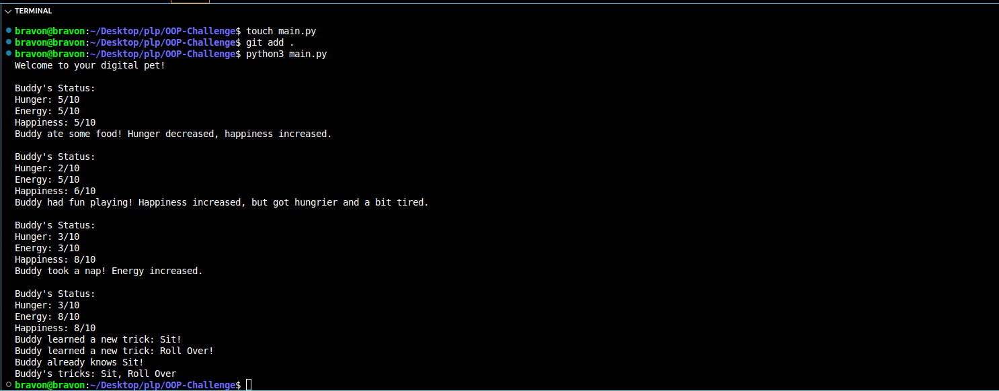

# 🐶 Python OOP Challenge: Build Your Own Digital Pet

Welcome to Group 56's Python OOP Challenge! 🎉

This project implements a virtual pet using Object-Oriented Programming in Python, allowing users to interact with a digital pet through actions like eating, playing, sleeping, and learning tricks. It demonstrates the use of classes, attributes, methods, and constructors.

---

## 🧠 Objective

Create a `Pet` class with the following:

### Attributes:
- `name`: The name of the pet (e.g., "Buddy").
- `hunger`: Integer representing hunger level (0 = full, 10 = very hungry).
- `energy`: Integer representing energy level (0 = tired, 10 = fully rested).
- `happiness`: Integer representing happiness level (0–10).
- `tricks`: List to store learned tricks (Bonus feature).

### Methods:
- `eat()`: Reduces hunger by 3 (minimum 0) and increases happiness by 1 (maximum 10).
- `sleep()`: Increases energy by 5 (maximum 10).
- `play()`: Decreases energy by 2, increases happiness by 2 (maximum 10), and increases hunger by 1 (maximum 10). Prevents playing if energy is too low.
- `get_status()`: Prints the current state of the pet.
- `train(trick)`: Teaches the pet a new trick, stores it in the `tricks` list, and increases happiness by 1 (Bonus).
- `show_tricks()`: Displays all learned tricks or a message if none exist (Bonus).

---

## 📂 Project Structure
- `pet.py`: Contains the `Pet` class implementation.
- `main.py`: Test script to create a pet and demonstrate its functionality.
- `README.md`: Project documentation.
- `.gitignore`: Excludes unnecessary files (e.g., `__pycache__`, `*.pyc`).
- `screenshots/output_screenshot.png`: Screenshot of the program output.

---

## 🚀 How to Run

1. **Clone the Repository**:

   git clone git@github.com:bravonokoth/OOP-Challenge-Group-56.git
   cd OOP-Challenge-Group-56

2. **Ensure Python 3 is Installed**:

3. **Run the Project**:

python3 main.py

4. **Expected Output**:

Welcome to your digital pet!
Buddy's Status:
Hunger: 5/10
Energy: 5/10
Happiness: 5/10

Buddy ate some food! Hunger decreased, happiness increased.
Buddy's Status:
Hunger: 2/10
Energy: 5/10
Happiness: 6/10

Buddy had fun playing! Happiness increased, but got hungrier and a bit tired.
Buddy's Status:
Hunger: 3/10
Energy: 3/10
Happiness: 8/10

Buddy took a nap! Energy increased.
Buddy's Status:
Hunger: 3/10
Energy: 8/10
Happiness: 8/10

Buddy learned a new trick: Sit!
Buddy learned a new trick: Roll Over!
Buddy already knows Sit!
Buddy's tricks: Sit, Roll Over

5. **View Output Screenshot**:

### 📷 Output Screenshot

Digital Pet Output

## Features Implemented

Core Requirements: Fully implemented Pet class with name, hunger, energy, happiness, and methods (eat, sleep, play, get_status).

Bonus Features:
train(trick): Adds unique tricks to a list and boosts happiness.
show_tricks(): Displays all learned tricks.

Edge Cases:
Attributes constrained to 0–10 using max() and min().
Prevents playing when energy is below 2.
Prevents duplicate tricks in train().

## Submission Details

Repository: github.com/bravonokoth/OOP-Challenge-Group-56

Submission Format: GitHub repository with code and output screenshot, or a zipped folder.

Collaborators: [Charmaine Ramaphala, Bravon Okoth, and Connie Wanjiru]

Screenshot: Included in screenshots/output_screenshot.png and displayed above.

## Tips for Reviewers

Run python3 main.py to see the pet in action.
Check pet.py for clean OOP implementation.
Verify edge cases (e.g., low energy, duplicate tricks) in the output.
Bonus points for our creative status messages and trick system! 

## Notes
Tested on Python 3.10+.
Contact [bravonokoth@gmail.com (mailto:bravonokoth@gmail.com)] for issues or open a GitHub issue.
Future enhancements: Add pet types (e.g., dog, cat) or custom actions.